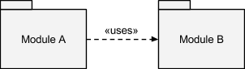

# Introduction

As of late, microservices are seen as the one true way to build any kind of system meant to run in the cloud. There has already been quite a lot of arguments regarding this but to some of us, it just feels more natural to build small reliable pieces of software with one specific purpose each. It boils down to the old _UNIX_ philosophy: “do one thing and do it well”.

What’s all the fuss about? What’s so different from your typical monolithic application? One could argue that in the latter, you can also have modules which could — and probably should — follow that same philosophy.

# Assumptions

The usage relationship between two modules of the same application used to be something really straightforward: if module A used module B, then one way or another, running A’s code would have run B’s code as well. How do you usually do that in code? With a function call of course! Don’t forget to include/import/etc module B and you’re be set to call all of its functions.

With microservices, modules are not always running in the same process or machine or data center. It has a lot of consequences, good and bad, but it all comes from the simple fact that you have replaced what could have been a single call instruction in the processor by a huge amount of code. This code lets you do a lot of wonderful things but as they say, with great power (balancing, queuing, scaling, etc) comes great responsibility (network failure, security holes, etc).

# Features and challenges

## Discovery

A needs B, but where is B? This is a solved problem with solutions ranging from the lightweight _multicast DNS (mDNS)_ and _DNS service discovery (DNS-sd)_ combo to the heavyweight _Apache ZooKeeper_ distributed configuration server.

## Load-balancing

You may actually want to communicate with something that’s not the real B but a load-balancer sitting in front of multiple instances of B. It can also spawn new instances of B or shutdown idle instances depending on the load.

## Queuing

Even with a load-balancer, you’re still at risk of something going haywire: all the instances of B might be down temporarily or, on the contrary, they might be over capacity and in both cases, having a queue to store jobs to be done would be a good idea to avoid losing some. It can also apply some back-pressure if the caller supports it to limit the influx of new jobs when becoming memory-constrained.

## Network failure

If you have a network, you can bet that at some point it’s going to fail. Be it a hardware problem or a software misconfiguration, some packets are going the end up somewhere they shouldn’t, or they might not even leave.

## Crash

B might crash while processing A’s request. You have multiple coping strategies: A can fail too, A can retry with a small delay, or if you have a queue, the queue system itself can restart jobs for which it did not receive an acknowledgement from B. This works by keeping the jobs in the queue until an instance of B acknowledges that it has finished processing it. This way, whatever happens to the instance, the job is never lost. Having a special manually-reviewed queue for jobs which failed repeatedly is common practice.

## Incompatibility

Malformed requests are a thing that happens, either because it has been sent to the wrong target or because the service has been upgraded and is not backwards-compatible.

## Statelessness

Depending on how services are built, having a queue or a load balancer in front can require some architectural changes to the caller since you cannot always expect to be talking to the same instance. It’s good practice to design stateless services which share a common distributed storage.

# Rethinking function calls

Let’s go back to the basics and dissect a function call. First of all, the caller prepares some some data which will be handed to the callee, then control is given to the callee which retrieves the data given to it, performs its task, prepares data to return to the caller, then gives control back to the caller which retrieves the return value and carries on with whatever it was doing before the call.

While a function call is something handled by the language and lower-level systems, calling a — more or less — remote service is something handled completely by the application or the framework it uses to abstract away the details. As a consequence, each of the tasks which make up a function call can be changed, delayed or removed and new ones can be added as well.

## Work queue

The most obvious change would be removing the “return” part altogether. Doing this gives you what you can expect from a background job processor: B does things whenever it decides to and A doesn’t care.

## Asynchronous processing

Without being as extreme as above, you could just remove the “pause A” part and let A continue its execution while B runs and at some point A will retrieve the return value.

## Event publishing

If instead of thinking about B as a module, you instead see it as a topic, you can publish regular events without knowing which systems are going to subscribe to them.

# Queues

As discussed above, queues enables a lot of interesting patterns including asynchronous or deferred processing, load balancing, publish/subscribe and even stream processing. There are multiple ways to implement queues like distributed message brokers which are, in other words, generic queue servers — most of them implement the complex _AMQP_ standard and often the lightweight _STOMP_ standard too — such as _RabbitMQ_, _Apache ActiveMQ_ and _Apache Apollo_; there are opinionated approaches like _Apache Kafka_ and _Apache Spark_; and there are lightweight per-socket queues such as _ZeroMQ_. Using a message broker introduces a single point of failure in the system and some _AMQP_-induced complexity but solves the discovery problem and provides reliable distributed queues by default, as well as some debugging features like support for correlation identifiers to track the original transaction which generated a chain of events. It is noteworthy that most message brokers support replying to requests, it is not necessarily one-way only, even though it’s not always simple to actually do that.

A simple way to think about this system is the design behind _Apache Kafka_ which is built around topics to which you can subscribe. When you do, you have to give a subscription group name and the broker distributes one copy of each new published event to each subscription group. This enables a form of load-balancing as well as a usual publish/subscribe system. It also keeps a pointer inside the queue of events to allow a subscription group to disappear and come back later — this works because _Kafka_ keeps a fixed amount of backlog, kind of like a ring buffer.

# Protocols

There are multiple approaches towards actually transmitting data between services. A common denominator is that data is usually encoded as _JSON_, even if the transport protocol varies, unless the desired throughput requires binary encoding with libraries like _Google Protobuf_. A lot of tools, mostly big-data oriented ones, also rely on the _Hadoop distributed file system (HDFS)_ to actually store data and keep the average message size small.

## HTTP

One approach is derived from what you’re used to when consuming information from web services: _HTTP REST APIs_. They’re easy to build and easy to test. They can carry data in any format, usually _JSON_, and they also have metadata, both in the _HTTP_ headers and method and in the _URL_ itself with positional and named parameters, ie path and query. It is extremely easy to build an _HTTP_ server in most languages, and it goes without saying that there are probably thousands of _HTTP_ client libraries. This approach requires knowledge of the target service’s hostname or IP address on the client side (§ Discovery, see above).

## AMQP (or STOMP)

Most event queues and message brokers implement the *Advanced Message Queuing Protocol* — or the simpler _HTTP_-inspired *Simple Text Orientated Messaging Protocol* — which can transmit a message along with metadata, some of which is actually used by the server itself to adjust how the message is delivered. Whether a service sends or receives messages, it is in both cases a client from the system’s standpoint. This approach only requires knowledge of the broker’s hostname or _IP_ address, not that of the actual recipient.

## Custom

Some toolchains come with their own protocols which are optimized for specific use cases. You also can build your own protocols with software like _Apache Thrift_ which generates source code in many languages and thus does all the network-related heavy lifting, but you’ll lose access to lots of tools both for monitoring and debugging your application by going down this path.

# Making it work

I hope you enjoyed this primer on Service-Oriented Architecture and Microservices. In the next article, you’re going to see how this can work in practice with a case study. In the meantime, remind yourself that there’s no silver bullet in software engineering with this interesting read in favor of monolithic systems: [The Majestic Monolith](https://medium.com/p/29166d022228).
