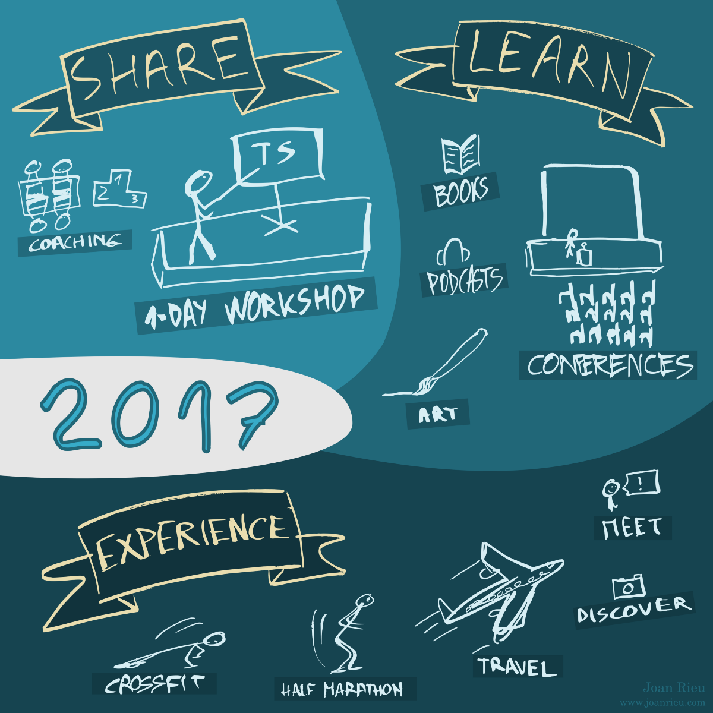
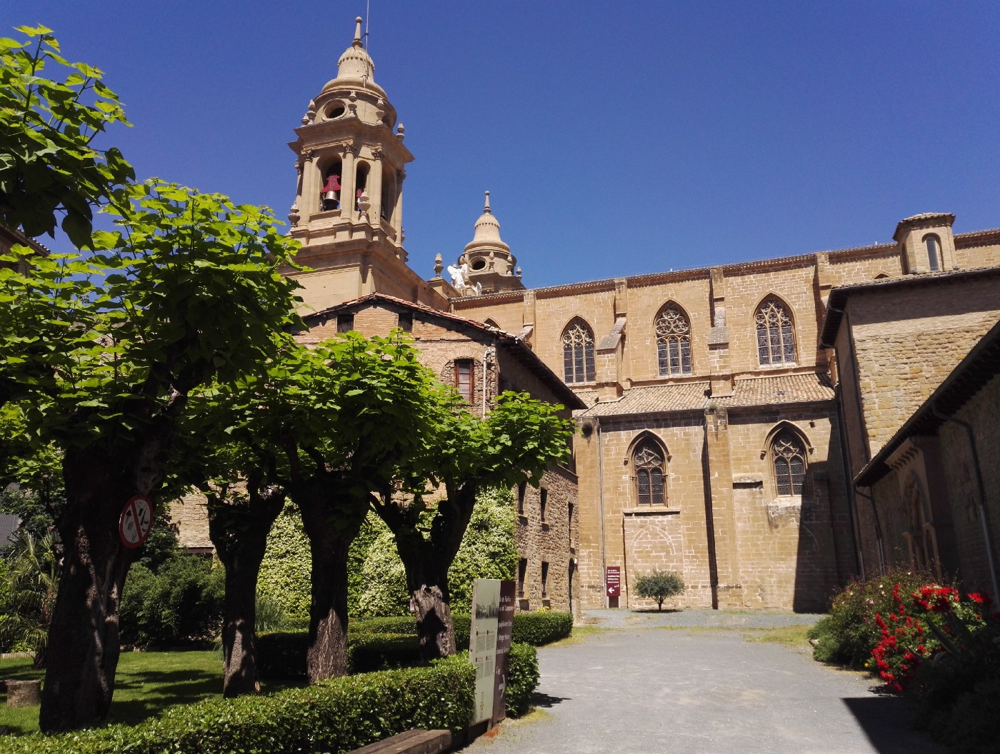

2017 is in the rear-view mirror. Before looking at what 2018 could bring, I’d like to take a moment to look at some personal highlights of 2017, with some stories and a few recommendations. Let’s go!

# Share what you’ve learned

Life is full of opportunities to give back to the community and I urge you to make the most out of them. If, like me, you love taking part in lots of events here and there, then it’s only normal to share your discoveries.

I’ve recently had the pleasure of hosting a full-blown 1-day workshop around _TypeScript_ at _Lectra_ for a group of experienced software engineers. It was the first time I gave a lecture for more than a few hours and it has been a wonderful experience. The very positive feedback I received is the greatest reward. It took me quite some time and energy to prepare the talk, the slides, the examples and the exercises, and seeing people enjoy the workshop from start to finish makes it all worth it.

Earlier this year, I also enjoyed presenting a challenge to a group of students of all horizons during _HackBordeaux_, as well as giving them a talk about _TypeScript_ and _RxJS_. I’ve participated in tons of hackathons in the past and being on the other side as part of the jury was a great experience! Making my company sponsor the event was one thing but helping the participants really mattered to me.

# Learn as much as you can

I’ve always loved diving deep into all kinds of subjects, mostly computer science related but not only, and this is something I try to keep doing on a daily basis. It’s very easy to get into a routine of just doing what you’ve always done but there is so much knowledge out there just waiting for you!

## Books & podcasts

**📚 “Getting Things Done” by David Allen** is a must-read for anyone. Whether you’re the CEO of a company, an office worker or a stay-at-home mom, you’re going to find very good advice in this book.

Although I had heard and read about the _GTD_ technique, I can now say that nothing replaces the actual book, because the tools and tips presented in the various summaries cannot replace the spirit and ideas that underlie the whole methodology. If you haven’t read it, go read it immediately, and if you have, read it again!

For me, this book is about:

Keeping yourself accountable in order to do good work.
Keeping track of what you have to do, how to do it and when to do it.
Never forgetting a commitment.
Keeping the present under control to think clearly about the future.
You wouldn’t believe the amount of stress you can avoid with _GTD_.

**📚 “Joy, Inc.” by Richard Sheridan** is a wonderful read. I fell in love with this book. The workplace described in it feels so much more human than anything I’ve seen. My belief is that your work needs to be your most fulfilling activity, and what’s going on at _Menlo Innovations_ is the natural complement : if your work is taking up most of your life, make sure your workplace embraces this idea and makes your (work-) life as enjoyable as possible. Enabling people to be more than workers is the best way to unleash their potential and to have a true win-win situation.

**🎧 “The Voluntary Life” by Jake Desyllas** contains a huge amount of advice on how to live a good life on your own terms. This podcast has hundreds of episodes covering topics like goal management, financial choices, travel and many, many others. I’ve been through a lot of life advice and self help resources, and what Jake is teaching through his podcast really resonated with me.

What’s more, I’ve had the opportunity to actually speak with him and discuss a few things that were on my mind. It’s been really helpful getting his perspective on what I’m trying to do with my own life, and I am very grateful.

## Conferences & lectures

When it comes to your job, doing the best you can is never enough, you need to make sure you master the best techniques out there.

**🎓 “Domain Driven Design” by Cyrille Martraire:** for a software engineer, _DDD_ is a different way of thinking about your job, how to build software. I’ve had the opportunity to be part of a masterclass given by Cyrille. He is one of the best when it comes to _DDD_ and his training gives you the keys to producing quality software.

**🎙 Newcrafts Bordeaux** has been the best conference I have attended this year. I enjoyed every single talk and got a lot of value out of talking to the various presenters and out of the many workshops. It was quite a small conference and that actually fostered a sense of community that you don’t have at the bigger conferences. It makes connecting with other people much easier.

## Art & DIY

Creativity is a muscle you need to train, so any kind of art you can make in your free time will help you perform better at work. How great is that?!

I’ve always dabbled in drawing and music, but I had never actually taken the time to go from 0 to 1 and create an actual “finished” piece. In the summer, I decided that it was time and I went ahead and spent some hours on both drawing and painting. This lead to me actually printing a t-shirt with my own design, as well as a painting I can hang on the wall!

Painting and drawing used not to be part of my skill set.

Always keep learning new skills, it will help you stay open-minded and prevent you from getting stuck with what you’ve always done. Widen your perspective! When you enjoy your work, it’s very tempting to consider your day finished when you leave your workplace. But there’s so much more you can do with your time, even by investing only a few minutes a day.

For example, something that didn’t take long to learn was how to replace a smartphone screen. After having paid to get it changed once, I decided that I would do it myself if I ever broke again (I did, twice). It turns out it’s really easy to do and very cheap (30€ instead of 150€)! Knowing how to do that is a good skill to have.

# Experience

Speaking of handwork, there are some things in life that you can only experience with your senses.

## Sport

Working as a team to reach a goal is something you learn with most sports, and working out with your colleagues is a good way to get to know them better! Outside of the workplace, people reveal themselves much more.

Staying in shape is as good for the body as it is for the mind, and giving yourself challenges and objectives is what can really drive you forward. Doing that on your own can be very challenging whereas it comes naturally when you have a team with you.

I spent a few months doing _CrossFit_ exercices at noon with my coworkers and I loved it! I also took part in the Bordeaux Semi-Marathon this year and last year, training alone. Those are two very different experience and I suggest you try both approaches to see what works best for you.

## Travel

On a lighter note, traveling is a great way to discover what the world has to offer.

The opportunity to travel for work is ideal when you otherwise have a desk job like most of us. I’ve had the pleasure of visiting some of our clients in Italy (Milano, Verona) and I’ve had a wonderful time there. Never miss a chance to talk to your clients and see how they actually use your products, watch them as they do their work using what you’ve built.

Of course, traveling for leisure is something you probably don’t need a reminder for. It’s also a good way to get rid of stress. Sometimes you can feel stuck in your corner of the world, but traveling even to nearby countries is easy and can really give you a breath of fresh air to get back on track. Feel the vibe of a new city, meet new people! I’ve had a great time discovering Norway (Oslo, Tronheim) as well as the Netherlands (Amsterdam), and I’ve had a lot of fun on a small road-trip through Spain (Pamplona 💛, Bilbao, San Sebastian).

Great weather (and delicious food!) in Spain.

# Wishes

This was my take on 2017, I’d love to hear what you have experienced this year and what your plans are for 2018. Find me on twitter [@joanrieu](https://twitter.com/joanrieu). I wish you all the best.

> Stay curious and share your discoveries!
